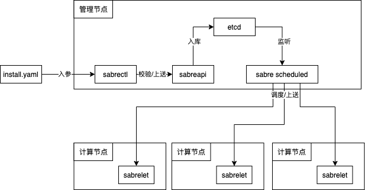

# Sabre (佩剑)
以IaC的方式，管理你想管理的资源。

## 项目简介
### 主要功能（当前功能）
- 基于yaml文件完成Tomcat、JDK的资源以及启动脚本的部署

### 组件说明
控制面 Master 节点主要包含以下组件：
- sabreapi，负责对外提供集群各类资源的增删改查及 Watch 接口，sabreapi 在设计上可水平扩展，高可用。当收到一个创建 资源 写请求时，将信息进行校验并写入到 etcd 中。
- sabrescheduler 是调度器组件，负责集群 资源 的调度。基本原理是通过监听 etcd 获取待调度的 资源，然后根据声明文件中的节点要求，将资源调度到资源归属的计算节点上。
- etcd 组件，sabre 的元数据存储。
Node 节点主要包含以下组件：
- sabrelet，部署在每个节点上的 Agent 的组件，负责 资源 的创建运行。基本原理是通过接收 sabrescheduler 调度命令，维护资源的声明周期。
命令行工具：
- sabrectl，可以部署在管理或者计算节点上，负责和sabreapi进行命令行的交互。


### 拓扑架构


### 执行流程
- 注册主机
```shell
$ sabrectl hosted 192.168.3.58 -a APP -n ERP
Server /xxx/192.168.3.58 registration succeeded
```

- 部署Tomcat
```shell
$sabrectl create tomcat /opt/sabre/pkg/util/tomcat/install/deployTomcat.yaml
```
deployTomcat.yaml 文件如下
```yaml
apiversion: beta
kind: Config
metadata:
    namespace: ERP
    netarea: APP
    appname: erp
spec:
    midtype: Tomcat
    version: 7.0.75
    installpath: /u01/app
    pkgdownloadpath: http://124.71.219.53:8001/uploads/uploads/2022/05/07/apache-tomcat-7.0.75.tar.gz
    midruntype:
        - cluster
    user:
        name: miduser
        group: miduser
    defaultconfig:
        tomcat:
            javaopts: -server -Xms1024M -Xmx1024M -Xss512k
            listeningport: "8099"
            ajpport: "8009"
            shutdownport: "8005"
    deployaction:
        action: Install
        deployhost:
            - 192.168.3.182
            - 192.168.3.58

```
## Quick start
### 环境依赖
- 操作系统
```
CentOS Linux release 8.2
```
- go版本
```shell
go version go1.17.3 
```
- 安装步骤


# Todo list
- [x] 中间单资源部署，已完成Tomcat、Jdk
- [ ] 完成本机器资源获取
- [ ] 中间单资源部署，完成Nginx、Redis
- [ ] 缓存资源部署，完成Redis集群部署
- [ ] 完成Etcd存储交付资源
- [ ] 完成资源集群模式的运维操作，包括启动、停止、重启
- [ ] 完成监控接口
- [ ] 完成CMDB接口

# 致谢
开发工具由[Jetbrains](https://www.jetbrains.com/)赞助的Pycharm